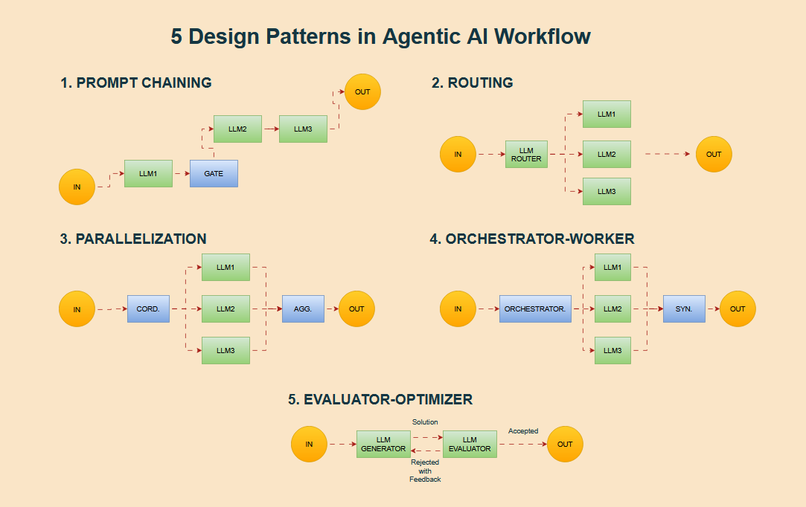
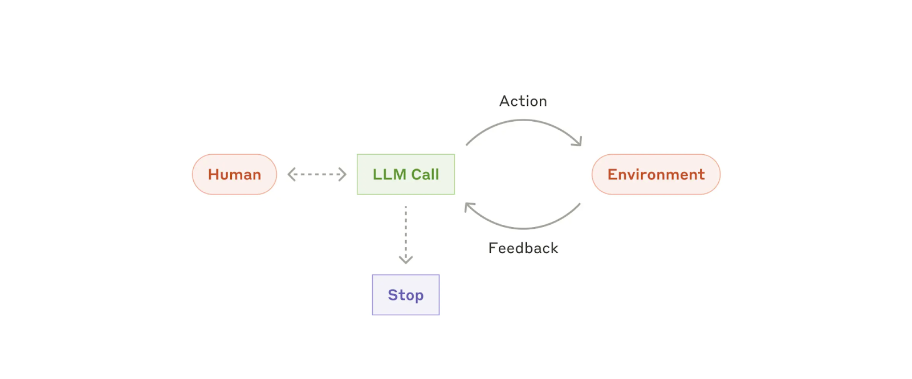

# Agentic-ai
The Complete Agentic AI Engineering Course (2025)

## AI Agents (Ambiguity !)
In practice, describes an AI solution that involves any or all of these:

1. Multiple LLM calls
2. LLM's with ability to use Tools
3. An environment where LLM's interact
4. A planner to coordinate activities
5. Autonomy
---
### By Huggingface
> AI Agents are programs where LLM outputs control the workflow.
> - AI model capable of reasoning, planning, and interacting with its environment.
>- An Agent is a system that leverages an AI model to interact with its environment in order to achieve a user-defined objective. It combines reasoning, planning, and the execution of actions (often via external tools) to fulfill tasks
---

### By Antropic

> Agentic Systems are of 2 types
> - Workflows are systems where LLM's and tools are orchestrated through predefined code paths
> - Agents are systems where LLM's dynamically direct their own processes and toold usage, maintain control over how they accomplish tasks.

---

## Workflow Design Patterns

1. PROMPT CHAINING  
Decompose into fixed sub-tasks (foundation/lab1.ipynb)
2. ROUTING  
Direct an input into a specialized sub-task, ensuring separation of concerns.
3. PARALLELIZATION  
Breaking down tasks and running multiple substasks concurrently.
4. ORCHESTRATOR-WORKER  
Complex tasks are broken down dynamically and combined.
5. EVALUATOR-OPTIMIZER  
LLM output is validated by another

---

## Agent Patterns

By Contrast, Agents:
1. Open-ended
2. Feedback loops
3. No fixed path

---

## Risks of Agent Frameworks

- Unpredictable path
- Unpredictable output
- Unpredictable costs

Mitigations

- Monitor => trace's
- Guardrails => to enable agents behave safely, consistently and within intended boundaries
